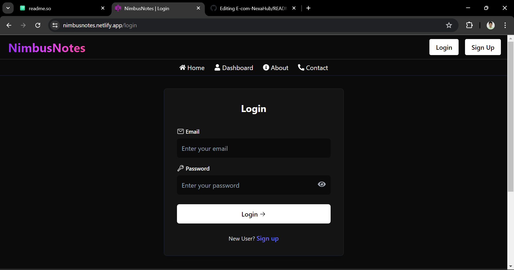
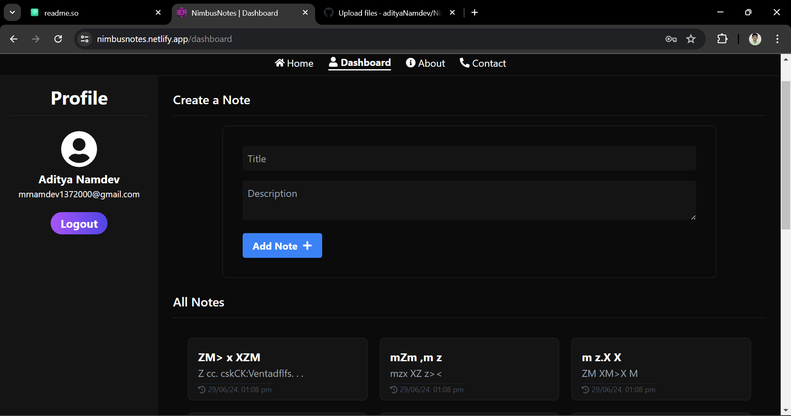

#  NimbusNotes

NimbusNotes is a cloud-based note-taking application that allows users to write, save, and access their notes from anywhere and on any device. This project includes user authentication, ensuring that only logged-in users can view their notes.

## Table of Contents

- [Features](#features)
- [Live demo](#live-demo)
- [Setup and Installation](#setup-and-installation)
- [Technologies Used](#technologies-used)
- [Usage](#usage)
- [ScreenShots](#screenshots)


## Features

- User authentication with JWT
- Create, read, update, and delete notes
- Access notes from any device
- Responsive design


## Live demo

NimbusNotes live demo , Please check it out here : [click me](https://nimbusnotes.netlify.app/).

## Setup and Installation

### Prerequisites

- Node.js
- MongoDB

### Installation

1. Clone the repository:

   ```bash 
   git clone https://github.com/yourusername/NimbusNotes.git 
   ```
2. Navigate to the project directory:
     ```bash
     cd NimbusNotes
     ```
3. Install frontend dependencies:
      ```bash
      cd client
      npm install
      ```
4. Install backend dependencies:
     ```bash
     cd ../server
     npm install
    ```    

### Environment Variables
Create a .env file in the server directory and add the following variables:
1. PORT=
2. CORS_ORIGIN=
3. MONGODB_URI=
4. JWT_SECRET=


## Technologies Used

### Frontend
- React
- React Router
- Context API
- Tailwind CSS

### Backend
- Express
- MongoDB
- JWT (JSON Web Token)
- bcrypt

## Usage
- Register for an account or log in if you already have one.
- Once logged in, you can create, view, edit, and delete your notes.
- Notes are saved in the cloud and can be accessed from any device.

## Screenshots




